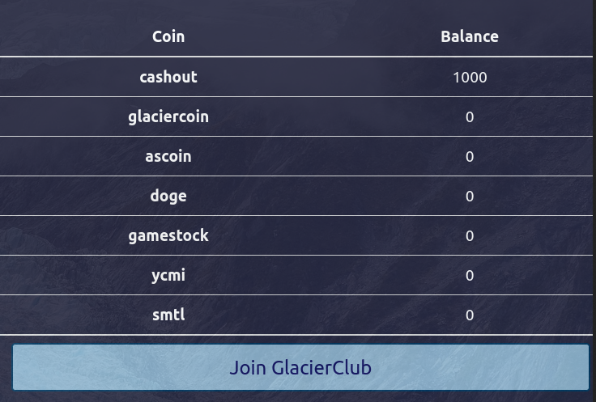
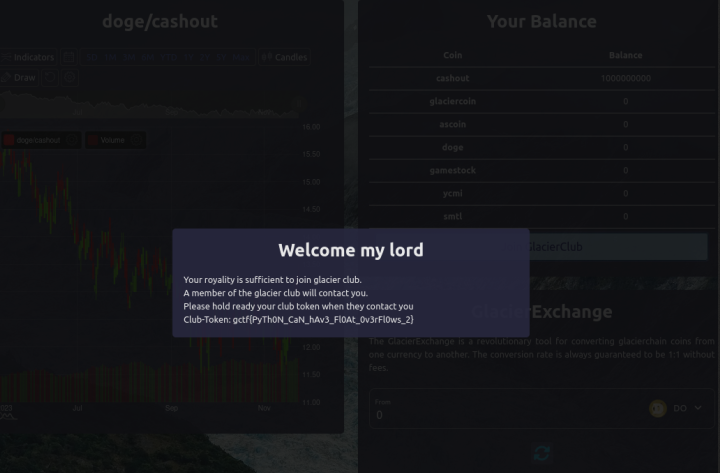

# Glacier Exchange

_**Keywords:** Python Float Overflow_


Glacier Exchange is a web challenge that highlights a simple yet often overlooked Python vulnerability related to mathematical operations involving float variables.

The challenge presents a web platform for currency exchange, with the initial portfolio situation depicted as follows:



Upon inspecting the source code, it becomes apparent that to read the flag, one must have a balance of 1000000000 coins in "cashout" and 0 in other categories.

```python
def inGlacierClub(self):
    with self.lock:
        for balance_name in self.balances:
            if balance_name == "cashout":
                if self.balances[balance_name] < 1000000000:
                    return False
            else:
                if self.balances[balance_name] != 0.0:
                    return False
        return True
```

Simultaneously, there is no validation on the user-entered amount for transactions:

```python
def transaction(self, source, dest, amount):
    if source in self.balances and dest in self.balances:
        with self.lock:
            if self.balances[source] >= amount:
                self.balances[source] -= amount
                self.balances[dest] += amount
                return 1
    return 0
```

Thus, transactions can be made with negative amounts without any checks.

Understanding this, the objective becomes generating currency. To achieve this, we can follow these steps:

1. Transfer -1e+30 coins from "cashout" to "glaciercoin";

2. Transfer -1000000000 coins from "doge" to "cashout." This exploits the Python Float Overflow vulnerability, causing subtractions between numbers of vastly different orders to be ignored. The addition, however, proceeds without issues. Essentially, new currency is generated;

3. Transfer 1e+30 coins from "cashout" to "glaciercoin" to nullify the transaction from step 1;

4. Transfer 1000000000 coins from "doge" to "cashout".

After these steps, the desired situation is achieved.

At this point, clicking "Join GlacierClub" yields the flag!

